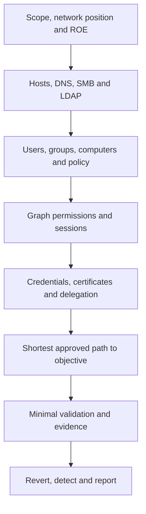

# Active Directory and internal networks

Active Directory testing is graph analysis. A username, computer, group, certificate template or delegated right is a node; the permissions and authentication paths between them are edges. The assessment asks which edges are intended, which are too broad, and whether a controlled identity can move from the current foothold to a defined objective.

!!! note "What we are doing"
    We begin with network position and identity context, read policy before attempting credentials, collect the minimum directory data needed to model trust, and validate one path at a time. “Domain Admin” is not the goal by itself; the goal is to demonstrate the agreed business objective and explain how defenders can see and remove the path.

## The AD assessment loop



| Phase | Plain-language question | Useful output |
| :--- | :--- | :--- |
| **Position** | Which VLAN, VPN, cloud network or jump host am I on? | Subnet, routes, DNS, egress and exclusions |
| **Inventory** | Which hosts and services exist? | Host/service inventory with timestamps |
| **Identity** | What can the current account read or change? | User, group, policy, trust and ACL data |
| **Graph** | Which principals, sessions and permissions connect me to the objective? | BloodHound/LDAP graph and ranked paths |
| **Validate** | Can one low-impact step prove the path? | Controlled request, certificate, session or object change |
| **Close** | What did we create or change, and how will it be detected? | Cleanup log, IOCs, event IDs and remediation |

## Core terms

- **Domain Controller (DC):** a server providing directory, Kerberos, LDAP, DNS and often file/authentication services.
- **Principal:** a user, computer, group or service identity that can receive permissions.
- **ACL/ACE:** the permissions that connect a principal to an object. A short path often comes from an unexpected write right, not a missing password.
- **SPN:** a service identity used by Kerberos. Service accounts with SPNs deserve careful review because their password strength and delegation settings matter.
- **Delegation:** permission for one service or computer to act for a user to another service. Scope and target restrictions are the important security questions.
- **Tier 0:** identities and systems that control the directory or its trust anchors, including domain controllers, PKI and high-privilege groups.

## Pages in this section

- **[Enumeration and BloodHound](ad-enumeration-bloodhound.md)** — establish the directory model, permissions, trusts, sessions and shortest paths.
- **[Kerberos and credentials](kerberos-credential-attacks.md)** — pre-authentication, service tickets, relay, delegation and credential hygiene.
- **[ADCS and ACL abuse](adcs-delegation-acl.md)** — certificate templates, enrollment endpoints, object rights and controlled escalation validation.
- **[Lateral movement and pivoting](lateral-movement-pivoting.md)** — choose a remote execution method and tunnel only the network segment required.
- **[Domain dominance and persistence](domain-dominance-persistence.md)** — high-impact validation, recovery implications, detection and cleanup.

## Lab and engagement setup

Keep environment setup separate from exploitation. It should make the target unambiguous and make authentication reproducible without placing real passwords in a shared notes file.

```bash
# Add only approved lab hosts to the local resolver file.
printf '%s\n' '<DC_IP> <DOMAIN> dc01.<DOMAIN> dc01' \
  | sudo tee -a /etc/hosts

# Confirm the DC exposes the services needed by the next phase.
nmap -Pn -sV -p 53,88,135,139,389,445,464,636,3268,3269,5985 \
  <DC_IP> \
  -oA "evidence/<TARGET_NAME>/dc-baseline"

# Ask LDAP for the naming contexts. This is an observation, not an exploit.
ldapsearch -x -H "ldap://<DC_IP>" -s base -b "" \
  namingContexts defaultNamingContext
```

If Kerberos is in scope, synchronize time and document the source before debugging authentication. A clock error can look like a credential or ticket failure.

## Safety gates

- Read the password and lockout policy before any spray; use one controlled round and a stop condition.
- Treat relay, coercion, certificate requests, ACL changes and delegation changes as explicit approval items.
- Prefer reading and graphing over changing directory objects.
- Use dedicated test accounts and objects; never reset a real user's password to prove a path.
- Record every account, host, command, timestamp and object changed.
- Remove machine accounts, certificates, key credentials, ACLs, RBCD entries, scheduled tasks and routes before closing.

## What to put in the report

Explain the path in human terms: **current identity → permission or credential → intermediate object → target objective**. Include the directory object, the exact right or policy setting, the minimal proof, relevant security events, and the remediation. A graph screenshot is useful; it is not a substitute for naming the edge that made the path possible.
