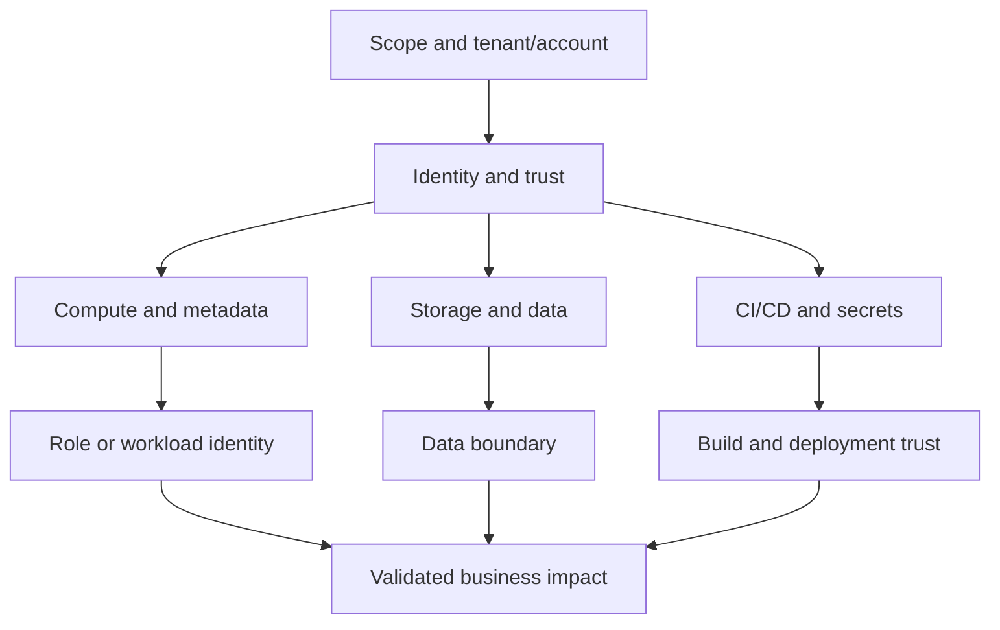

# Cloud security

Cloud assessments are usually identity assessments with an API around them. The important question is not only whether a bucket, VM or function is exposed; it is **which identity can perform which action on which resource, from which trust boundary, and what can that action reach next?**

!!! note "What we are doing"
    We begin with the account or workload identity, map permissions and trust relationships, test read access before write access, trace one approved chain at a time, and revoke anything we create. A public object, a role, or a token is a lead; impact comes from the data or control boundary it crosses.

## Cloud attack-surface model

| Boundary | Questions to answer | Safe first evidence |
| :--- | :--- | :--- |
| Identity | Who issued this key/token, what is its lifetime, and what can it assume? | Caller identity and effective policy, with secrets redacted |
| Tenant/account | Are projects, subscriptions, accounts and organizations separated? | IDs, trust relationships and role assignments |
| Workload | Can a VM, pod, function or pipeline receive a more privileged identity? | Metadata/configuration read, not a resource-changing command |
| Data | Is the object public, cross-account, versioned, logged or recoverable? | A canary object or metadata, not a customer dataset |
| Automation | Can a build, deployment or webhook run with a sensitive role? | Pipeline definition, branch protection and least-privilege review |
| Recovery | Can keys, sessions, roles, policies and resources be revoked quickly? | Rotation/revocation path and audit evidence |

## Pages in this section

- **[AWS, Azure/Entra ID and GCP](aws-azure-gcp.md)** — identity discovery, storage and metadata review, IAM escalation paths, hybrid identity and cleanup.

## A cloud assessment in plain language

1. **Confirm the account:** identify the cloud, tenant/project/account, principal, source network and authorization ticket.
2. **Read before writing:** list permissions, policies, role assignments, service principals, workload identities and trust conditions.
3. **Choose a canary:** use a client-approved object, test secret or non-production resource to prove access.
4. **Trace the chain:** if identity A can assume role B, document the condition and ask what B can reach; stop when the business objective is proven.
5. **Check controls:** inspect logging, conditional access, MFA, network boundaries, key age, secrets rotation and denial policies.
6. **Revoke and verify:** remove keys, sessions, policies, role assignments, resources and test data; confirm the audit trail.

## Common misconceptions

| Misconception | Better question |
| :--- | :--- |
| “The bucket is public, so the impact is obvious.” | Are versions, logs, backups, exports or customer records accessible, and can a canary prove it? |
| “The role is read-only.” | Does it read secrets, assume another role, access every tenant, or invoke a function with a stronger identity? |
| “MFA is enforced.” | Are service principals, legacy protocols, recovery flows, device code, workload identities and exclusions covered? |
| “The mobile key is public.” | Is it an identifier or a credential, what scopes does it have, and does server-side authorization still hold? |
| “Cloud testing is configuration review.” | Can a real identity cross from a workload to data, from cloud to on-premises, or through CI/CD? |

## Report and remediation

Name the identity, action, resource and condition: **principal → permission → resource → data/control impact**. Recommend the smallest fix that removes the path: least-privilege policy, explicit resource condition, short-lived credential, workload identity restriction, private endpoint, deny boundary, branch protection, logging or key rotation. Include the rollback and detection steps, not only a policy screenshot.
