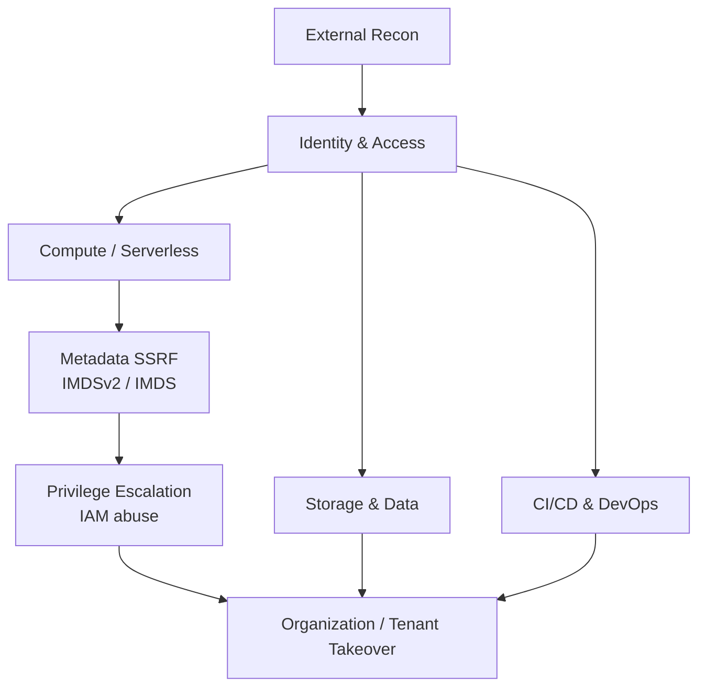

# Cloud security

---

## Cloud Attack Surface Model

Modern cloud compromise is **identity-driven**: the initial foothold is usually a leaked token, an over-permissive role, or a workload identity that can be assumed — not a CVE.

---

## Pages in this section

  - **[AWS, Azure / Entra ID & GCP](aws-azure-gcp.md)** — AWS IAM privesc paths, S3 misconfigurations, EC2 metadata (IMDSv2), SSM role abuse, Azure/Entra device-code & PRT abuse, AzureHound, and GCP service account impersonation.

---

## Common Misconceptions I Encounter in Reports

| Misconception | Reality |
| :--- | :--- |
| "The bucket is public, so it's fine — no sensitive data." | Enumerate **versions**, **logs**, **backups**, and **presigned URL leaks** before rating impact. |
| "The IAM role is read-only." | `ReadOnlyAccess` often includes `s3:GetObject` on every bucket + `secretsmanager:GetSecretValue` if policy is broad. Always enumerate actions. |
| "MFA is enforced." | Check **legacy auth**, **API-only accounts**, **service principals**, **device-code flows**, and **conditional access exclusions**. |
| "Mobile apps can't be reverse engineered." | A 15-minute JADX + strings pass frequently reveals hardcoded keys, internal endpoints, and staging credentials. |
| "Cloud pentest = config review." | The best findings chain identity → compute → data across services (e.g. SSRF → IMDS → role → S3 → CI/CD token). |