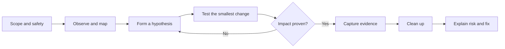

# How to use this vault

This site is a **field reference**, not a collection of commands to run without context. The pages answer two different questions:

1. **What are we trying to learn?** We are mapping trust boundaries, finding where a security control is missing, and proving whether that gap changes what an attacker can do.
2. **What should we do next?** We choose the least disruptive test that can answer the question, record the evidence, and stop when the impact is proven.

The commands are examples for systems you own, a dedicated lab, or a written engagement scope. Substitute the target values, read the explanation beside a command, and verify the result before moving to the next step.

!!! danger "Authorization is the first prerequisite"
    Do not scan, authenticate, spray, upload, intercept, exploit, persist, or exfiltrate against a system unless you have explicit permission and the activity is in scope. A lab snapshot is the safest place to learn a destructive technique. If the rules of engagement do not name an action, treat it as out of scope until the client confirms it.

## The universal workflow

Every section in the vault follows the same loop. The tools change; the reasoning does not.



| Phase | In plain language | Evidence to keep |
| :--- | :--- | :--- |
| **1. Scope** | Know who authorized the work, which assets are included, the time window, rate limits, and emergency contact. | Signed scope, target list, rules of engagement, test account names |
| **2. Observe** | Establish a baseline before changing anything. Learn what responds, who you are, and which trust boundary you are examining. | Timestamps, versions, baseline request/response, host and account context |
| **3. Hypothesize** | Turn an observation into a testable question: “Does this endpoint enforce tenant ownership on update, or only on read?” | The observation, expected secure result, expected insecure result |
| **4. Test** | Use the narrowest safe request or lab reproduction that distinguishes the two outcomes. Avoid spraying or destructive payloads when a single controlled request is enough. | Raw request, raw response, input values, account/role used |
| **5. Validate** | Reproduce from a clean session or a second test account. Separate a scanner signal from a real security boundary failure. | Before/after comparison, second-account result, repeatability notes |
| **6. Prove impact** | Demonstrate the smallest meaningful business impact. Do not collect more data than needed; redact secrets in notes and screenshots. | Minimal proof, affected object, affected role, data class, business consequence |
| **7. Close** | Remove test accounts, files, keys, routes, certificates, ACLs, tickets and persistence. Restore configuration and tell the client what cannot be reversed. | Cleanup log, deletion confirmation, IOC list, client notification |
| **8. Report** | Explain the issue so another person can reproduce it and fix it. A command without interpretation is not a finding. | Summary, steps, evidence, impact, severity, remediation, detection ideas |

## Start with the right page

Use the section that describes the trust boundary you are testing. It is normal for one assessment to move through several sections; the links show how they connect.

| If you are testing… | Start with… | Then ask… |
| :--- | :--- | :--- |
| Public domains and hosts | [Recon](recon/index.md) | What is exposed, and which host is worth deeper testing? |
| A browser application or API | [Web and Bug Bounty](web-bugbounty/index.md) | Does the server authenticate the user and authorize the object, action, and tenant? |
| A Windows domain | [Active Directory](active-directory/index.md) | How does the identity graph connect the foothold to sensitive systems? |
| A controlled adversary simulation | [Red Team](red-team/index.md) | Which objective and detection opportunity are we measuring? |
| A shell on a host | [Privilege Escalation](privesc/index.md) | Which local control or credential can change the current security context? |
| An Android or mobile app | [Android](android/index.md) | What does the client store, trust, expose, and send? |
| A cloud account, workload, or tenant | [Cloud](cloud-mobile/index.md) | Which identity can assume, read, write, or delegate to something more sensitive? |
| A long engagement with repeated checks | [Checklists](checklists-arsenal/index.md) | What have we covered, what remains, and what must be cleaned up? |

## Target worksheet

Fill this in before copying a command. It keeps examples from being run against the wrong host and makes the final report easier to write.

```yaml
# A local worksheet is safer than putting real secrets into shell history.
assessment: "<ASSESSMENT_NAME>"
authorization: "<ROE_OR_TICKET_REFERENCE>"
target: "<TARGET_OR_APPLICATION>"
scope:
  - "<HOST_OR_CIDR>"
  - "<DOMAIN_OR_API>"
exclude:
  - "<DO_NOT_TOUCH>"
operator_context: "<VPN_OR_JUMP_HOST>"
test_accounts:
  low_privilege: "<LOW_PRIV_ACCOUNT>"
  elevated: "<ELEVATED_TEST_ACCOUNT>"
window_utc: "<START> to <END>"
rate_limit: "<REQUESTS_PER_SECOND_OR_CLIENT_RULE>"
```

The placeholders used throughout the site have narrow meanings:

| Placeholder | Meaning | Do not assume |
| :--- | :--- | :--- |
| `<TARGET_IP>` | One host being tested | It is the domain controller or the only in-scope host |
| `<DOMAIN>` | A DNS name or AD realm, depending on the page | That DNS, Kerberos and email all use the same name |
| `<DC_IP>` | A domain controller used for an AD lab or engagement | That the first LDAP server is the forest root |
| `<LHOST>` / `<LPORT>` | Your controlled listener or callback endpoint | That a callback is allowed by the rules of engagement |
| `<USER>` | A deliberately scoped test identity | That it has administrative rights |
| `<VICTIM_ID>` | A second test object used to demonstrate an authorization boundary | That it is a real person's account or data |

Pages with command placeholders show a **Command variables** panel in the site. The panel changes what is displayed and copied in the browser; it does not edit the Markdown source or validate that a value is safe. Check the substituted command before running it.

## How to read a command block

A clean block should answer three things: **what it does, why the option is present, and what result changes the next decision**. Commands are grouped by phase rather than dumped into one long line.

```bash
# Step 1 — create a private evidence directory for this target.
# Keeping output together makes the work reproducible and simplifies cleanup.
mkdir -p "evidence/<TARGET_NAME>/{raw,notes,artifacts}"

# Step 2 — record the time and the operator context before testing.
# This is useful when client logs use UTC or when multiple testers share a host.
date -u | tee "evidence/<TARGET_NAME>/notes/start-utc.txt"
whoami | tee -a "evidence/<TARGET_NAME>/notes/operator.txt"
```

The command block contains executable input only. Expected output belongs in a separate block so nobody accidentally pastes it back into a shell:

```text
# Example output — illustrative only; compare it with the target you are authorized to test.
2026-10-06T12:00:00Z
operator@example-lab
```

Use the language that matches the content:

- `bash`, `powershell`, `python`, and `javascript` for executable code.
- `http`, `json`, `graphql`, `sql`, `xml`, `yaml`, or `nginx` when the syntax itself matters.
- `text` for payload lists, tool output, diagrams, and interactive prompts.
- Comments explain intent, assumptions, cleanup, and interpretation. They are not a substitute for the prose around a risky action.

### A practical block format

When adding or correcting a page, prefer this order:

1. One sentence describing the question the step answers.
2. A fenced block with one language and one phase.
3. A short “What to look for” paragraph or output block.
4. The next decision, including when to stop.

```bash
# Purpose: compare the response for a test object with the response for a
# second object owned by another test account. Use a lab or approved scope.
curl --silent --show-error \
  --header "Authorization: Bearer <TEST_TOKEN>" \
  "https://<DOMAIN>/api/items/<TEST_OBJECT_ID>" \
  --output "evidence/<TARGET_NAME>/raw/object.json"
```

What matters is not the `200` by itself. Compare the object owner, fields, tenant identifier, and side effects with the result from the second account. A secure application may return `403`, `404`, or a deliberately indistinguishable response; document which behavior the application defines and whether it is consistent.

## Evidence and reporting standard

A useful finding is a small, repeatable argument:

```text
Observation -> security control expected -> controlled test -> result -> impact -> fix
```

For each finding, capture:

- **Title:** the broken control and the affected asset, not just a tool name.
- **Context:** target, account/role, timestamp, request ID, and any assumptions.
- **Steps:** the shortest reproducible sequence. Include the exact request or command, but redact passwords, tokens, private keys, and unnecessary personal data.
- **Expected versus actual:** what a secure implementation would do and what the target did instead.
- **Impact:** which confidentiality, integrity, or availability boundary changed; connect it to a business asset.
- **Scope:** one object, one tenant, a service, a host, or the whole environment.
- **Remediation:** the server-side or platform control that closes the gap, plus validation criteria.
- **Detection:** useful logs, events, telemetry, or alerts a defender could use.
- **Cleanup:** test data and changes removed, or explicitly handed back to the client.

### Report template

```markdown
## Finding: <BROKEN_CONTROL> on <ASSET>

**Severity:** <RATING>  
**Affected scope:** <HOST, ENDPOINT, TENANT OR ACCOUNT>  
**Tested as:** <TEST_ACCOUNT_OR_ROLE>  
**Observed:** <UTC_TIMESTAMP>

### What is happening
<Explain the control failure in one paragraph. Avoid leading with a tool name.>

### Reproduction
1. <Establish the baseline.>
2. <Send the controlled request or perform the controlled action.>
3. <Compare the response or side effect.>

### Expected and actual behavior
- **Expected:** <The authorization, validation or isolation rule.>
- **Actual:** <What the target allowed or disclosed.>

### Impact
<Describe the smallest proven business impact and the boundary crossed.>

### Remediation
<Give a specific server-side fix, configuration change or process control.>

### Detection and cleanup
- <Relevant logs or alerts.>
- <Test data removed and changes reverted.>
```

## Safety gates for noisy or irreversible tests

Some pages contain techniques that can lock accounts, alter directory permissions, create cloud resources, interrupt services, or expose sensitive data. Before running one, answer all of these:

- Is the exact action named in the scope?
- Is there a lab or test account that gives the same evidence?
- What is the abort condition?
- How will the client detect and roll back the change?
- What is the cleanup command or owner?
- What is the minimum data needed to prove impact?

If any answer is unknown, stop at reconnaissance and ask the engagement owner. A lower-severity, well-evidenced finding is better than a stronger finding created by an uncontrolled outage.

## Quality checklist before publishing a note

- [ ] The page explains the goal before the command.
- [ ] The prerequisite identity, host, tool version, and permissions are stated.
- [ ] Every executable block has a language tag and uses one language only.
- [ ] Commands and sample output are in separate blocks.
- [ ] Non-obvious flags and destructive actions have comments or prose.
- [ ] Placeholders are consistent and clearly defined.
- [ ] The expected secure result and the vulnerable result are both explained.
- [ ] Evidence, remediation, detection, and cleanup are included.
- [ ] Examples use lab values and do not include real credentials or private data.
- [ ] The site builds without broken links or malformed Markdown.
