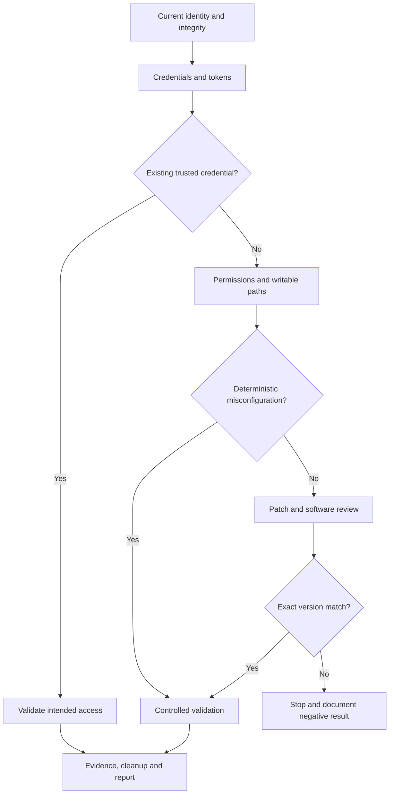

# Privilege escalation overview

Privilege escalation is a change in **security context**: from a low-privilege user to a more trusted local account, service identity or operating-system level. The reliable way to find it is to understand what the current identity can read, write, execute or impersonate, then validate the smallest path that changes that context.

!!! note "What we are doing"
    We are not running every exploit suggested by an automated tool. We first identify the operating system and identity, enumerate permissions and secrets, confirm an anomaly, reproduce it with a low-impact action, and only then consider a version-specific exploit. The command is evidence for a reasoning chain, not the reasoning itself.

## The decision tree

## What to record before changing anything

| Question | Linux examples | Windows examples |
| :--- | :--- | :--- |
| Who am I? | `id`, `groups`, `sudo -l` | `whoami /all`, group membership, integrity level |
| What runs with trust? | cron, systemd, SUID, capabilities | services, scheduled tasks, tokens |
| What can I write? | scripts, units, PATH directories, mounts | service binary/path, registry, task files |
| What secrets are reachable? | history, `.env`, SSH keys, configs | DPAPI, unattended files, registry, browser or service config |
| What is the blast radius? | one process, container, host | one service, host, domain or credential |

## Pages in this section

- **[Linux privilege escalation](linux-privesc.md)** — identity, sudo, SUID/capabilities, scheduled work, credentials, containers and kernel review.
- **[Windows privilege escalation](windows-privesc.md)** — tokens, services, registry, UAC, credentials, DPAPI and patch-level validation.

## Order of preference

1. **Existing credentials or keys** — lowest operational risk; validate only the access needed for the objective.
2. **Explicit permission mistakes** — sudo, service, task, registry, ACL, SUID or capability issues.
3. **Writable scheduled or startup paths** — prove with a harmless marker where possible.
4. **Container or orchestration boundaries** — confirm the host/data exposure before changing anything.
5. **Exact-version software or kernel issue** — last resort because crashes and incomplete cleanup are common.

A collector such as linPEAS or winPEAS improves coverage; it does not prove exploitability. Re-check its finding manually, note the running version and permissions, and capture a before/after result.

## Evidence and cleanup

For a local escalation finding, record the original identity, the vulnerable permission, the controlled action, the resulting identity, the affected host and the cleanup. Remove marker files, scheduled tasks, services, compiled binaries, copied secrets and temporary credentials. If the test involved a crash-prone exploit, state the lab validation and do not imply production safety without evidence.
