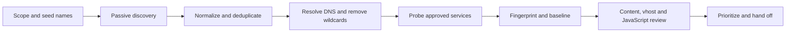

# Reconnaissance

Reconnaissance answers a simple question: **what is in scope, what is reachable, and which path deserves a closer look?** The goal is not to collect the largest possible list of hosts. The goal is to build a trustworthy attack-surface map, remove false positives, and hand the next phase a small set of well-described targets.

!!! note "What we are doing"
    We start with low-noise sources such as public DNS, certificate transparency and historical records. We then verify names, resolve them, probe only approved hosts, and record the service, technology, response and owner. Every later test should be explainable from this map.

## What a good recon handoff contains

| Output | Why it matters |
| :--- | :--- |
| Scope and exclusions | Prevents an interesting but unauthorized asset from becoming a mistake. |
| Normalized asset list | One hostname or IP per line, with source and first-seen time. |
| DNS relationships | A, AAAA, CNAME, MX and TXT records reveal providers, trust boundaries and forgotten services. |
| Live-service inventory | Scheme, port, status, title, server, technology and IP make triage repeatable. |
| Interesting leads | Admin panels, old versions, source maps, exposed files and unusual redirects, each with evidence. |
| Confidence and next action | “Verify manually”, “safe to fuzz”, “needs client clarification” or “close as duplicate”. |

## Recon pipeline



The two loops are deliberately separate:

- **Passive discovery** observes data that already exists: certificates, DNS, public code, ASN ownership and search indexes. It is usually the safest first move.
- **Active verification** sends traffic to an approved target: DNS resolution, port scans, HTTP probes, crawling and controlled content discovery. It is more informative, but it must respect rate limits and exclusions.

## Pages in this section

- **[Subdomains, ASN and virtual hosts](subdomain-enumeration.md)** — Find related names horizontally, discover hostnames vertically, validate DNS, test virtual hosts and assess dangling third-party records.
- **[Ports and services](port-service-enumeration.md)** — Discover reachable TCP/UDP services, then choose a service-specific enumeration path instead of running every script everywhere.
- **[Web recon and fuzzing](web-recon-fuzzing.md)** — Establish an HTTP baseline, discover content, map parameters, crawl JavaScript and identify documentation or debug surfaces.
- **[OSINT and dorking](osint-dorking.md)** — Use public search and asset indexes to find leaked references, old infrastructure and exposed documentation without guessing blindly.

## A careful workflow in one pass

### 1. Create a workspace and preserve provenance

The folder names are part of the process: raw input is kept separate from normalized output and evidence. Use a directory outside the repository for real engagement data.

```bash
# Create a per-target workspace. Keep real engagement data out of the notes repo.
mkdir -p "recon/<DOMAIN>/{raw,subs,dns,http,ports,js,evidence}"

# Record the scope reference and UTC start time before collecting anything.
printf '%s\n' '<ROE_OR_TICKET_REFERENCE>' \
  > "recon/<DOMAIN>/evidence/scope-reference.txt"
date -u | tee "recon/<DOMAIN>/evidence/start-utc.txt"
```

### 2. Collect names, then normalize them

Use more than one passive source because each source has gaps. A certificate name is a lead, not proof that a host is owned by the target or still live.

```bash
# Collect passive candidates from two tools and certificate transparency.
subfinder -d <DOMAIN> -all -silent -o "recon/<DOMAIN>/raw/subfinder.txt"
assetfinder --subs-only <DOMAIN> \
  > "recon/<DOMAIN>/raw/assetfinder.txt"
curl --silent --show-error \
  "https://crt.sh/?q=%25.<DOMAIN>&output=json" \
  | jq -r '.[].name_value' \
  | sed 's/^\*\.//' \
  | sort -u \
  > "recon/<DOMAIN>/raw/crtsh.txt"

# Normalize, remove empty lines, and keep one lowercase name per line.
cat "recon/<DOMAIN>/raw/"*.txt \
  | tr '[:upper:]' '[:lower:]' \
  | sed 's/\.$//' \
  | sed '/^$/d' \
  | sort -u \
  > "recon/<DOMAIN>/subs/candidates.txt"
```

**What to look for:** names outside the approved organization, wildcard records and third-party providers should be marked for review rather than silently promoted to targets.

### 3. Resolve and baseline live web services

Resolution tells you where a name points; an HTTP probe tells you what actually answers. Keep both results so a later change can be explained.

```bash
# Resolve only the candidate list with a resolver set approved for the engagement.
puredns resolve "recon/<DOMAIN>/subs/candidates.txt" \
  -r /usr/share/seclists/Miscellaneous/dns-resolvers.txt \
  -w "recon/<DOMAIN>/dns/resolved.txt"

# Probe common web ports and save status, title, server, IP and technology.
httpx -l "recon/<DOMAIN>/dns/resolved.txt" \
  -p 80,443,8000,8080,8443 \
  -sc -title -server -tech-detect -ip -cname \
  -threads 50 \
  -o "recon/<DOMAIN>/http/live-services.txt"
```

A `200` response is not automatically a vulnerability, and a `403` is not automatically a dead end. Record the baseline body size, redirect chain, authentication state and owner before fuzzing.

### 4. Prioritize, do not just accumulate

Give every live asset a next action:

1. **High value:** identity, billing, admin, API, staging, CI/CD, source maps or a unique data store.
2. **High confidence:** the DNS relationship, ownership and response are verified.
3. **Low noise:** the next request is inside scope and unlikely to create state.
4. **Documented:** the raw request, response and timestamp are saved.

## Common recon mistakes

- Treating a certificate transparency name as proof of ownership or current exposure.
- Fuzzing a wildcard DNS response without measuring and filtering the baseline.
- Running a full port scan against a third party named by a CNAME without checking scope.
- Mixing output from multiple tools without recording the source and timestamp.
- Reporting a banner or version alone without proving exploitability or business impact.
- Leaving credentials, client data or raw responses in a public notes repository.

## Handoff and reporting

The handoff should let another tester continue without repeating the whole collection phase. Include the target, source, timestamp, command/tool version, baseline and recommended next step. Close the loop when a lead is disproved; a clean negative result is useful evidence too.
