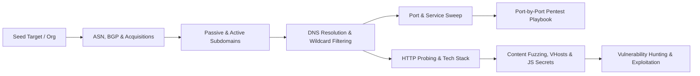

# Reconnaissance

My end-to-end reconnaissance workflow: map the attack surface first, then cut it down to the hosts that are actually worth testing.

---

## End-to-End Recon Pipeline



---

## Pages in this section

  - **[Subdomain, ASN & VHost Enum](subdomain-enumeration.md)** — BGP/ASN mapping, WHOIS/reverse WHOIS, Certificate Transparency, passive APIs, puredns brute-forcing, permutations, VHost fuzzing & Subdomain Takeovers.

  - **[Port & Service Playbook](port-service-enumeration.md)** — High-speed Masscan/RustScan/Nmap workflows and a complete port-by-port enumeration & exploitation matrix (FTP, SSH, DNS, Kerberos, SMB, LDAP, MSSQL, WinRM, Redis).

  - **[Web Recon, Fuzzing & JS Mining](web-recon-fuzzing.md)** — HTTPX probing, Katana/Gau crawling, FFUF/Feroxbuster directory & parameter fuzzing, JavaScript endpoint/secret extraction, and WAF fingerprinting.

  - **[OSINT and dorking](osint-dorking.md)** — High-signal Google Dorks, GitHub secret & config dorking, Shodan/Censys/FOFA queries for origin IP discovery, exposed dashboards, and cloud buckets.

---

## The workflow in one pass

```bash
# Create structured workspace for target <DOMAIN>
mkdir -p recon/<DOMAIN>/{subs,http,ports,js,urls,vulns} && cd recon/<DOMAIN>
# 1. Passive subdomain enumeration
subfinder -d <DOMAIN> -all -silent -o subs/subfinder.txt
assetfinder --subs-only <DOMAIN> > subs/assetfinder.txt
curl -s "https://crt.sh/?q=%25.<DOMAIN>&output=json" | jq -r '.[].name_value' | sed 's/\*\.//g' | sort -u > subs/crtsh.txt
# 2. Merge & resolve live DNS hosts via puredns
cat subs/*.txt | sort -u | puredns resolve -r /usr/share/seclists/Miscellaneous/dns-resolvers.txt -w subs/resolved.txt
# 3. Probe live web services & capture status, title, tech stack, and CNAME
httpx -l subs/resolved.txt -sc -title -tech-detect -cname -ip -vhost -threads 100 -o http/live_web.txt
# 4. Crawl historical + active URLs and extract JS files
cat subs/resolved.txt | gau --threads 10 > urls/gau.txt
katana -list http/live_web.txt -jc -kf all -d 3 -o urls/katana.txt
cat urls/*.txt | sort -u | grep -E "\.js(\?|$)" > js/js_files.txt
```