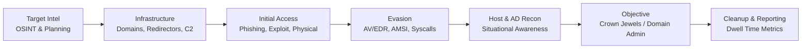

# Red team operations

---

## Where This Section Fits

Unlike a pentest, a **red team engagement** measures detection and response. Success is not "did I get Domain Admin" — it is *"did the blue team see me, and how long did it take them?"*

---

## Pages in this section

  - **[Initial Access & Payload Delivery](initial-access-phishing.md)** — Pretexting, Evilginx2/Microsoft device-code phishing, LNK/ISO/VHDX/IMG containers, HTML smuggling, MOTW bypasses, and macro tradecraft.

  - **[C2 Infrastructure & OPSEC](c2-infrastructure-opsec.md)** — Domain categorization, SMTP/SPF/DKIM/DMARC setup, redirectors (nginx/Apache mod_rewrite), CDN fronting, malleable C2 profiles (Sliver/Havoc), and operator hygiene.

  - **[EDR, AMSI & Syscall Evasion](edr-amsi-evasion.md)** — AMSI/ETW patching, unhooking (Ntdll, Halo's Gate, Tartarus Gate), indirect & fresh syscalls, PE/Shellcode loaders (Module Stomping, Phantom DLL), and C2 profiles.

---

## Engagement Phases & Deliverables

| Phase | Key Activities | Deliverable |
| :--- | :--- | :--- |
| **0. Scoping & ROE** | Define crown jewels, in-scope infrastructure, forbidden hosts, emergency contacts, rules of engagement | Signed ROE, deconfliction plan |
| **1. Threat Intel & Planning** | Determine threat actor emulation (APT29, FIN7, ransomware affiliate), map TTPs | Emulation plan (MITRE ATT&CK mapped) |
| **2. Infrastructure Setup** | Age and categorize domains, configure redirectors, prepare payloads | Infrastructure diagram, IOC list for blue team |
| **3. Initial Access** | Spearphishing, USB drops, exploit public-facing app, supplier compromise | Access evidence, timeline |
| **4. Foothold & Elevation** | Host recon, privesc, credential theft, persistence | Attack graph |
| **5. Objective Execution** | Achieve defined objectives (DCSync, crown jewel access, data exfil simulation) | Evidence + timestamps |
| **6. Cleanup & Reporting** | Remove artifacts, report TTPs + defensive recommendations + dwell time | Final report with purple-team findings |

!!! tip "Purple Teaming Note"
    Every action should map to a **detection opportunity**. Keep a parallel log of: `timestamp | technique | ATT&CK ID | host | expected telemetry source | detected (Y/N/M)`. This makes the debrief enormously more valuable than a raw screenshot dump.