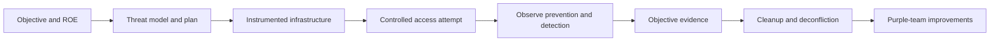

# Red team operations

A red team engagement is a controlled experiment in **prevention, detection and response**. The question is not simply “can an operator obtain a privileged session?” It is “can the team reach the agreed objective, what did the defenders see, how quickly did they respond, and what should change?”

!!! danger "ROE before tradecraft"
    Phishing, payload delivery, credential testing, evasion, persistence, lateral movement and simulated exfiltration require written scope. Record the abort condition for every high-risk activity. Never reuse infrastructure, credentials or payloads between clients.

## The red team loop



| Phase | What we are doing in words | Deliverable |
| :--- | :--- | :--- |
| **Scope** | Define the business objective, allowed identities, assets, time window, prohibited actions and emergency contact. | Signed ROE and deconfliction plan |
| **Plan** | Choose a threat emulation and map each planned action to a detection opportunity. | ATT&CK-mapped test plan |
| **Prepare** | Separate operator, research and C2 identities; create short-lived infrastructure; test the kill switch. | Infrastructure diagram, IOC register, rollback plan |
| **Access** | Use the least risky approved access path and stop if the objective is already proven. | Initial-access timeline and evidence |
| **Operate** | Move only as far as the objective requires; measure control coverage rather than collecting everything. | Action log, telemetry observations, objective proof |
| **Close** | Remove access and notify the client of anything that cannot be safely removed during the window. | Cleanup confirmation and residual-risk list |
| **Learn** | Turn each action into a defensive improvement and retest after the fix. | Detection gap and purple-team report |

## Pages in this section

- **[Initial access and payload delivery](initial-access-phishing.md)** — approved delivery scenarios, user-safety constraints and evidence.
- **[C2 infrastructure and OPSEC](c2-infrastructure-opsec.md)** — segmented infrastructure, logging, identity separation and deconfliction.
- **[EDR and AMSI evasion](edr-amsi-evasion.md)** — lab-first validation of prevention and telemetry assumptions; not a promise of invisibility.

## Detection log

Keep one line per meaningful action. A detection gap is only useful when the defender can reproduce the expected telemetry.

```text
# UTC timestamp | operator action | ATT&CK technique | host/account |
# expected telemetry | observed telemetry | detected? | evidence reference
<UTC> | <ACTION> | <T####> | <HOST>/<ACCOUNT> |
<EXPECTED_SOURCE> | <OBSERVED_SOURCE> | <YES_NO_PARTIAL> | <FILE_OR_TICKET>
```

Record both successful and blocked actions. A blocked payload, MFA prompt, EDR quarantine or account lockout is evidence about a control; it is not a reason to silently escalate the technique.

## Engagement guardrails

- Separate simulation data from real client data; use a canary or marker file where possible.
- Never collect a full mailbox, password database or customer dataset when a canary proves access.
- Rate-limit email, authentication and discovery actions to the agreed threshold.
- Do not disable security controls unless the ROE explicitly requires a measured test and a rollback is ready.
- Use a client-approved out-of-band channel for a safety stop, not the C2 channel alone.
- Keep infrastructure, domain, certificate, hash and payload IOCs ready for the defender before the debrief.

## What success looks like

A strong red team result can be “the objective was blocked at MFA and the alert arrived in four minutes.” A strong result can also be “the objective was reached, but the client can now see the exact missing control.” The report should include the timeline, objective evidence, detection latency, prevention points, cleanup status and a prioritized remediation plan.
